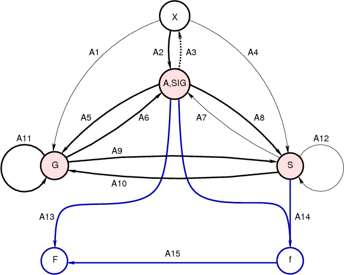

MVGC（Multivariate Granger Causality Analysis） ToolBox

## VAR模型

$$
U_t=\sum_{k=1}^{p}A_{k} \cdot U_{t-k}+\epsilon_t
$$

​	$p$是模型的阶数，可以直到无穷大。

​	$A_k$是一个$n\times n$的实数矩阵，是回归系数。

​	$\epsilon _t$是余量，独立同等分布连续不相关（iid），也就构成了白噪声过程。

​	$U_t$是当前时间点t的值，可以由过去的时间点$t-1,…,t-p$的值来预测。回归系数代表了可预测的部分，余量代表了不可预测的部分。

确定一个VAR模型不意味着随机过程模型$u_t$的时间序列的数据是由真实的线性自回归设计产生。相比于有效连接技术（如DCM动态因果模型）而言，DCM对于观测数据的底层产生机制需要非常严格的假设。而VAR模型的底层是GC，更加通用，对于数据产生机制无需假定。

对于VAR模型的改进：

​	已有的GCA，VAR系数需要满足平方可加性和稳定性。平方可加性需要$\sum ^p _{k=1}\|A_k\|^2 < \infty$，意味着就算模型阶数p是无穷的，系数也不能blow up。（对于有限阶的模型，平方可加性总是满足的）；稳定性意味着回归系数定义一个协方差不变的过程，关联与$A_k$的多项式特性$\varphi_A(z)\equiv |I-\sum_{k=1}^{p} A_{k}z^k|$ 变量z定义在一个复平面C上。

。。。后面一堆看不懂😂😂😂

$𝚪_k \equiv cov(u_t, u_{t-k})  \space\space\space  k=…,-2,-1,0,1,2,...$

由于稳定性（时不变），$𝚪_{-k} = 𝚪_k ^⟙$对于所有的lag（延迟） k都成立

对于一个VAR过程，自共变序列和VAR参数相关，通过Yule-Walker公式：

$𝚪_k =\sum_ℓ ^p A_ℓ𝚪_{k-ℓ} +𝛿_{k0}\sum \space \space k=…,-2,-1,0,1,2,... $

------------------------------------------------------------------------------------------------------

==跳过大篇幅的公式推导和说明。。。。==

直接进入**4.3 Application to fMRI BOLD data**

在fMRI BOLD领域的Granger分析一直很有争议。问题如下：

+ BOLD信号（血液动力响应函数HRF）是非直接的、缓慢的、易变的（局部内的和被试间的）、底层的神经元活动的传递。

+ 典型的fMRI协议采用的采样间隔TR严重的低采样，常在1~3s间，比典型的神经元间的延迟要长的多。区域间的HRF变异对GrangerCausality analysis的影像带来特别大的争议：加入X引起的Y，但是X的BOLD响应的peak却比Y的peak晚，那么GC就会得到错误的因果，从而认为Y引起X。也许这也不是问题。在实际中，fMRI BOLD信号的GC在很大范围内是健壮的，包括time-to-peak这种明显的问题。这是因为，HRF是一个缓慢的移动平均滤波，对GC而言理论上是不变的。（直观的来说，就是卷积和延迟是不同的。Seth 2013做了一些模拟证明这一点）

不幸的是，严重的低采样率加上测量的噪声，还是在一些应用中剥离了GC推论。当HRF混杂了其它因素在里面的时候，错误的GC推论确实存在。这个基本上让GC在fMRI数据中无法应用。技术进步支持了超低的TR，去噪等手段来减轻这些问题。

一些保守的策略可以使用：

- 使用尽可能短的TR
- 检查不同实验条件间的GC的变化，而不是试图区分“底层真相ground truth”的GC类型
- 把GC强度和行为变量（实验的反应时间）等联系起来，计算出叫做“影响差异”的东西，可能会提高一些健壮性
- 其他的方法包括，state-space模型估计联合的功能连接和血流动力学响应，或者盲去卷积来得到底层的神经元过程。

总之，GC在fMRI中的使用需要小心，最好是以探索的方式去解释。

--------------

## 下面是关于那个help文档

### MVGC 运算流程

 

### 数据结构

以下是MVGC toolbox常用的变量名称和约定。

**n,nvars** 	   number of variables
**m,nobs**  	   number of observations (time steps)
**N,ntrials**	  number of trials (realisations) of a process
**p,q,…**   	 number of lags or frequencies
**x,y,z,…**  	vector of sub-variables indices
**fs**      	   sample rate (e.g. in Hz)
**fres**    	   frequency resolution
**X,Y,Z,…** 	 Time series data: an n x m matrix for single-trial, or an n x m x N matrix for multi-trial data. The first index references variables, the second observations and the third (if present) trials.
**A**          VAR coefficients: an n x n x p matrix containing coefficients for an n-variable VAR(p). The first index references target ("to") variables, the second source ("from") variables and the third lags.
**SIG**        Residuals covariances: and n x n symmetric positive-definite matrix containg residuals covariances for an n-variable VAR.
**G**          Autocovariance sequence: an n x n x (q+1) matrix containing autocovariances of a time series up to q lags. The first index references target ("to") variables, the second source ("from") variables and the third lags. The k-th block G(:,:,k) corresponds to k-1 lags; the first block G(:,:,1) is thus a covariance matrix.
**S**          Cross-power spectral density (cpsd): an n x n x (q+1) matrix containing cpsds of a time series at a resolution of q. The first index references target ("to") variables, the second source ("from") variables and the third frequency. Frequencies generally run from zero up to (and including) the Nyqvist frequency; i.e. block S(:,:,1) corresponds to frequency zero and block S(:,:,q+1) corresponds to the Nyqvist frequency.
**H**          VAR transfer function: an n x n x (q+1) matrix containing transfer function components of a VAR at a resolution of q. The first index references target ("to") variables, the second source ("from") variables and the third frequency.
**F**          Time-domain multivariate Granger causality: for the pairwise- conditional case, an n x n matrix containing pairwise- conditional causalities; the first index then references target ("to") variables and the second source ("from") variables, with NaNs on the diagonal.
**f**          Frequency-domain (spectral) multivariate Granger causality: for the pairwise-conditional case, an n x n x (q+1) matrix containing pairwise-conditional spectral causalities; the first index references target ("to") variables, the second source ("from") variables and the third frequency, with NaNs on the ÷diagonal for each frequency block f(:,:,k).

### 算法

| 名称   | 描述                            | 实现                                       |
| :--- | ----------------------------- | :--------------------------------------- |
| A1   | 由时序数据估计自协方差（autocovariance）序列 | tsdata_to_autocov                        |
| A2   | 由时序数据估计VAR模型                  | tsdata_to_var，tsdata_to_infocrit         |
| A3   | 模拟（多）VAR过程                    | var_to_tsdata，var_to_tsdata_nonstat      |
| A4   | 由时序数据估计cpsd                   | tsdata_to_cpsd                           |
| A5   | 由VAR参数计算自协方差序列                | var_to_autocov                           |
| A6   | 由自协方差序列计算VAR参数                | autocov_to_var                           |
| A7   | 由cpsd计算VAR参数                  | cpsd_to_var                              |
| A8   | 由VAR参数计算cpsd                  | var_to_cpsd                              |
| A9   | 由自协方差序列计算cpsd（fft）            | autocov_to_cpsd                          |
| A10  | 由cpsd计算自协方差序列（ifft）           | cpsd_to_autocov                          |
| A11  | 变换自协方差以减少回归                   | autocov_xform                            |
| A12  | 变换cpsd以减少回归                   | cpsd_xform                               |
| A13  | 由VAR参数计算时域因果                  | var_to_autocov，autocov_to_var，autocov_to_mvgc，autocov_to_pwcgc |
| A14  | 由VAR参数和cpsd计算频域的因果            | var_to_autocov，autocov_to_var，autocov_xform，autocov_to_smvgc，autocov_to_spwcgc |
| A15  | 由频域因果（整体）计算时域因果（限宽的）          | smvgc_to_mvgc                            |